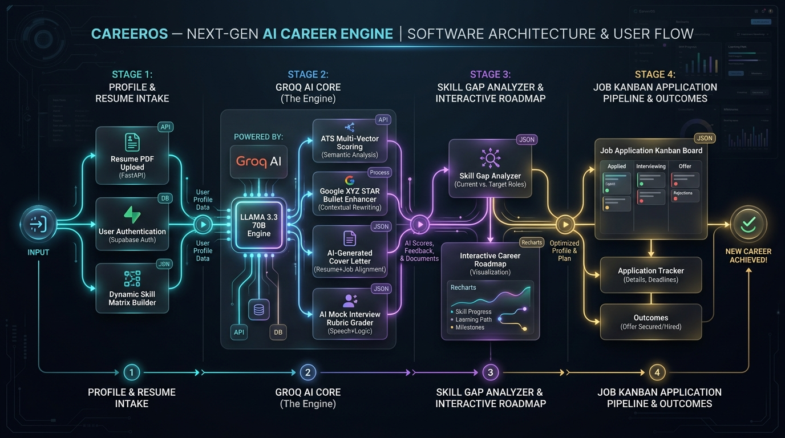
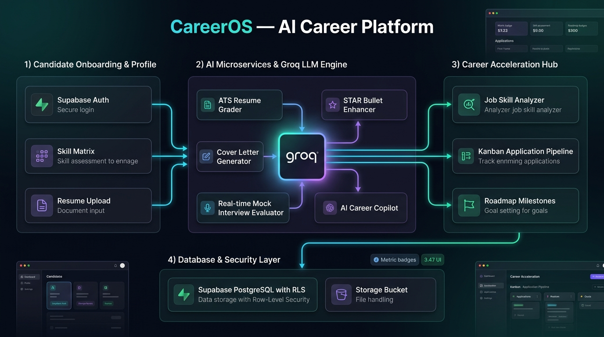

# CareerOS — Next-Gen AI Career Platform for College Students & Freshers

**CareerOS** is a production-ready, full-stack AI career acceleration platform engineered specifically for college students, recent graduates, and entry-level engineers to identify skill gaps, optimize resumes with ATS metrics, match job descriptions, drill technical interviews with instant rubric grading, generate personalized roadmaps, and manage their application pipeline.

---

## 📸 Architecture & AI Pipeline Overview

### End-to-End AI Pipeline & Data Flow


### System Layer Architecture


---

## 📁 Repository Structure

```
CareerOS/
├── frontend/             # React 19 + TypeScript + Vite + Vanilla CSS
│   ├── src/
│   │   ├── components/   # UI components, layout shell, navbar, sidebar
│   │   ├── contexts/     # AuthContext (Supabase JWT), ToastContext
│   │   ├── pages/        # 12+ pages (Dashboard, Resume, Interview, AI Studio, etc.)
│   │   ├── services/     # API clients (FastAPI AI engine + Supabase DB client)
│   │   └── index.css     # Dark SaaS theme tokens, glassmorphism & responsive CSS
│   ├── public/           # Static assets
│   ├── package.json      # Dependencies (React 19, Recharts, Lucide, Supabase JS)
│   ├── vite.config.ts    # Vite configuration & manual chunking
│   └── Dockerfile        # Production Nginx container definition
│
├── backend/              # Python FastAPI AI Engine
│   ├── routers/          # Modular AI endpoints
│   │   ├── cover_letter.py        # Tailored cover letters & outreach
│   │   ├── bullet_enhancer.py     # STAR Google XYZ bullet rewriting
│   │   ├── interview_evaluator.py # 4-vector rubric mock interview grader
│   │   ├── career_copilot.py      # Conversational career mentor
│   │   ├── resume_analyzer.py     # Multi-dimensional ATS resume analyzer
│   │   ├── job_matcher.py         # JD skill matching & gap roadmaps
│   │   └── roadmap_generator.py   # Phased career roadmaps & project milestones
│   ├── services/         # LLM Engine (Pure Groq SDK with JSON mode & auto-retry)
│   ├── main.py           # FastAPI entrypoint, CORS & health checks
│   ├── requirements.txt  # FastAPI, Groq, Pydantic, PyPDF, Uvicorn
│   └── Dockerfile        # Python 3.11 backend container definition
│
├── supabase/             # Database schemas & migrations
│   └── schema.sql        # Tables, RLS policies, storage bucket rules, DB triggers
│
├── docs/                 # Documentation & architectural diagrams
│   └── images/           # High-resolution pipeline & architecture images
│
├── docker-compose.yml    # Multi-container orchestration (Frontend + AI Backend)
├── package.json          # Root workspace convenience scripts
└── README.md
```

---

## 🚀 Key Features & AI Capabilities

1. **AI Career Studio (`/ai-studio`)**:
   - **Tailored Cover Letter Generator**: Generates customized, JD-aligned cover letters highlighting authentic candidate projects.
   - **STAR Resume Bullet Polisher**: Rewrites weak draft bullet points into metric-rich statements following Google's **XYZ Formula** (*"Accomplished [X] as measured by [Y], by doing [Z]"*).
   - **Recruiter & Alumni Cold Outreach**: Generates high-conversion LinkedIn connection notes (<300 chars) and InMail/email referral pitches.
2. **AI Live Interview Prep & Answer Evaluator (`/interview-prep`)**:
   - Practice role-specific technical and behavioral questions across difficulty tiers (*Easy, Medium, Hard*).
   - Instant 0–100 rubric scoring across 4 dimensions: **Technical Accuracy**, **STAR Structure**, **Depth**, and **Communication Clarity**.
   - Generates upgraded Staff-level model answers with actionable feedback.
3. **Multi-Vector Resume & ATS Analyzer (`/resume-analysis`)**:
   - Upload PDF/DOCX or paste resume text for instant scoring across 4 vectors: **Technical Depth**, **Impact Metrics**, **Structure & Formatting**, and **ATS Match Score**.
   - Automatic missing keyword detection with concrete bullet-point improvement suggestions.
4. **Job Skill Analyzer & Recharts Visualizations (`/job-analyzer`)**:
   - Paste any target Job Description (JD) to automatically extract required vs. preferred technologies, calculate percentage match, and generate a step-by-step preparation plan.
5. **Canonical & Custom Role Roadmaps (`/roadmap`)**:
   - Phased role roadmaps (*Foundations ➔ Core Mastery ➔ Production Architecture ➔ Capstone Project*) with interactive progress tracking.
6. **Application Kanban Pipeline (`/applications`)**:
   - Drag-and-drop / stage management for job applications (*Saved, Applied, Assessment, Interview, Offer, Rejected*), target salary tracking, and custom interview notes.
7. **Global AI Career Copilot**:
   - Multi-turn conversational AI career mentor accessible across the platform for real-time guidance.
8. **Enterprise-Grade Multi-Tenant Isolation**:
   - Supabase PostgreSQL with strict **Row Level Security (RLS)** (`auth.uid() = user_id`) and automated profile creation triggers.

---

## 🛠️ Tech Stack

- **Frontend**: React 19, TypeScript, Vite, React Router v7, Recharts, Lucide React
- **AI Microservice**: Python 3.11+, FastAPI, Uvicorn, Pydantic, Groq SDK (`llama-3.3-70b-versatile`)
- **Database & BaaS**: Supabase (PostgreSQL 15, GoTrue Auth, Storage Buckets, Row-Level Security, PostgreSQL Triggers)
- **Styling**: Pure Vanilla CSS Design System (Custom dark SaaS theme tokens, responsive layouts, glassmorphism)
- **Containerization**: Docker, Docker Compose, Nginx

---

## 🔌 AI Engine REST API Endpoints

| Method | Endpoint | Description |
| :--- | :--- | :--- |
| `GET` | `/api/health` | Healthcheck & Groq LLM availability status |
| `POST` | `/api/cover-letter/generate` | Generates targeted cover letter & outreach notes |
| `POST` | `/api/bullets/enhance` | Rewrites bullets using Google XYZ STAR formula |
| `POST` | `/api/interview/evaluate` | Evaluates candidate answer with 4-vector rubric |
| `GET` | `/api/interview/questions` | Retrieves role-based question bank |
| `POST` | `/api/resume/analyze` | Evaluates resume text & computes ATS metrics |
| `POST` | `/api/jobs/match` | Matches candidate profile against a Job Description |
| `POST` | `/api/roadmap/generate` | Generates a custom phased learning roadmap |
| `POST` | `/api/copilot/chat` | Conversational multi-turn AI career copilot |

---

## 📦 Local Development Setup

### 1. Prerequisites
- **Node.js**: v18+ (v20+ recommended)
- **Python**: v3.11+
- **Supabase Account**: Project URL & Anon Key
- **Groq API Key**: Free tier or enterprise key from [console.groq.com](https://console.groq.com)

### 2. Environment Variables Configuration

- **Frontend** (`frontend/.env`):
  ```env
  VITE_SUPABASE_URL=https://your-project-ref.supabase.co
  VITE_SUPABASE_ANON_KEY=your-supabase-anon-key-here
  VITE_AI_BACKEND_URL=http://localhost:8000
  ```

- **Backend** (`backend/.env`):
  ```env
  PORT=8000
  HOST=0.0.0.0
  GROQ_API_KEY=gsk_your_groq_api_key_here
  GROQ_MODEL=llama-3.3-70b-versatile
  ```

### 3. Database Initialization
Run the SQL migration script located in [`supabase/schema.sql`](supabase/schema.sql) in your Supabase SQL Editor to provision tables, triggers, and Row Level Security policies.

### 4. Running the Frontend
```bash
# From the repository root:
npm --prefix frontend install
npm --prefix frontend run dev
```
The frontend will start at `http://localhost:5173`.

### 5. Running the FastAPI AI Engine
```bash
# In a separate terminal:
python -m pip install -r backend/requirements.txt
python -m uvicorn backend.main:app --port 8000 --reload
```
API documentation (Swagger UI) is available at `http://localhost:8000/docs`.

---

## 🐳 Docker Multi-Container Deployment

To build and start both the Frontend (Nginx) and the Python FastAPI AI Backend with a single command:

```bash
docker-compose up --build -d
```

- **Frontend App**: `http://localhost:3000`
- **FastAPI AI Backend**: `http://localhost:8000`
- **Interactive Swagger Docs**: `http://localhost:8000/docs`

To stop the containers:
```bash
docker-compose down
```

---

## 🛡️ Security & Reliability Features
- **Deterministic AI Outputs**: LLM calls enforce strict JSON mode with Pydantic schema validation and fallback error handlers.
- **Tenant Isolation**: PostgreSQL Row Level Security (RLS) ensures candidates can only access their own resumes, evaluations, and job applications.
- **Zero-Storage Secrets**: Groq API keys remain strictly server-side within the Python FastAPI microservice.
